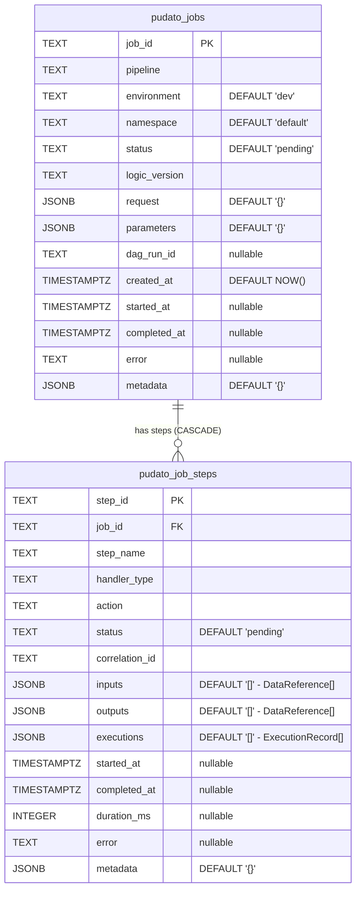

# Registry Database Schema

The Job Registry uses PostgreSQL to track pipeline execution history, step-level lineage, and reproducibility metadata.

**Source of truth**: `src/pudato/backends/registry.py`

## ER Diagram



## JSONB Structures

The `inputs`, `outputs`, and `executions` columns store arrays of structured objects defined in `src/pudato/protocol/messages.py`.

### DataReference (inputs / outputs)

```json
{
  "ref_type": "table | file | stream | model | api",
  "location": "main.stg_departments | s3://bucket/path | kafka://topic",
  "format": "parquet | csv | json | iceberg | avro | null",
  "metadata": { "row_count": 100, "bytes": 4096 }
}
```

### ExecutionRecord (executions)

```json
{
  "execution_type": "sql | python | spark | ml_training | dbt | api_call",
  "details": {
    "dialect": "duckdb | postgres | athena",
    "statements": ["SELECT ..."],
    "command": "build | run | test",
    "models": ["stg_departments"],
    "project_dir": "dbt/"
  }
}
```

## Indexes

### pudato_jobs

| Index | Column |
|-------|--------|
| `idx_jobs_pipeline` | `pipeline` |
| `idx_jobs_environment` | `environment` |
| `idx_jobs_namespace` | `namespace` |
| `idx_jobs_status` | `status` |
| `idx_jobs_created_at` | `created_at` |

### pudato_job_steps

| Index | Column |
|-------|--------|
| `idx_steps_job_id` | `job_id` |
| `idx_steps_status` | `status` |
| `idx_steps_started_at` | `started_at` |

## Foreign Key

`pudato_job_steps.job_id` references `pudato_jobs.job_id` with `ON DELETE CASCADE` — deleting a job removes all its steps.
